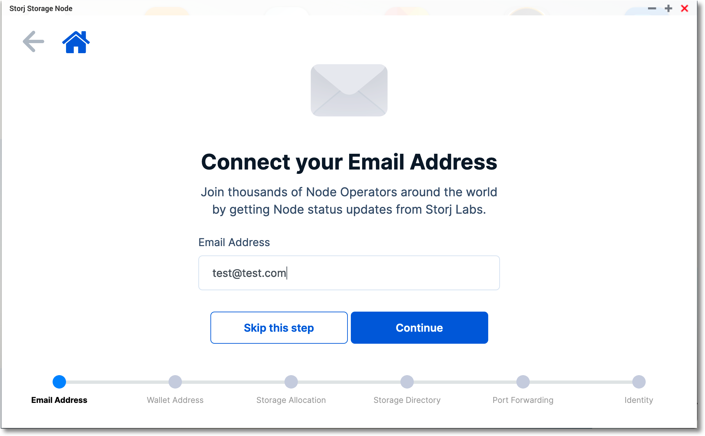
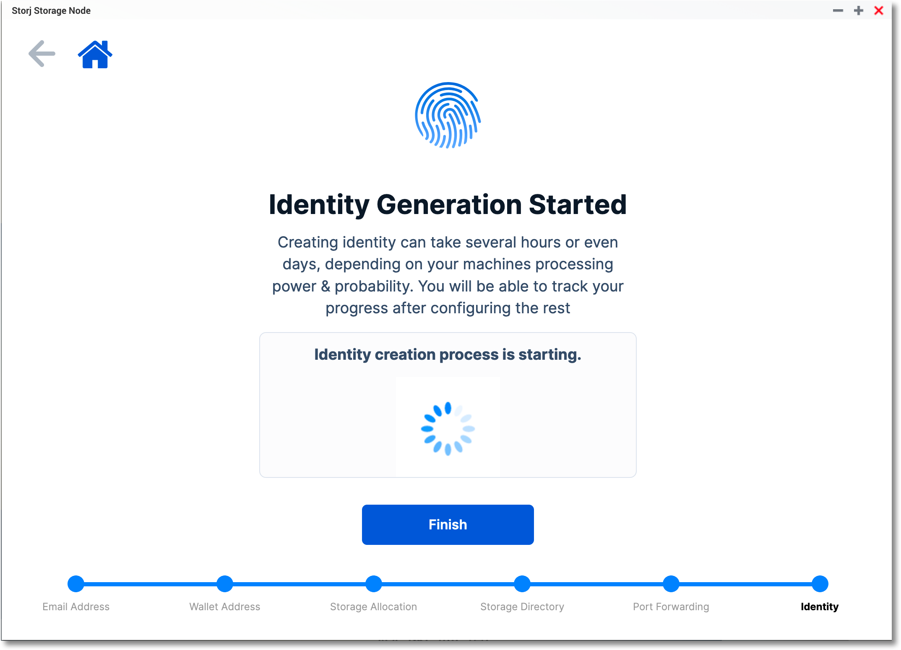
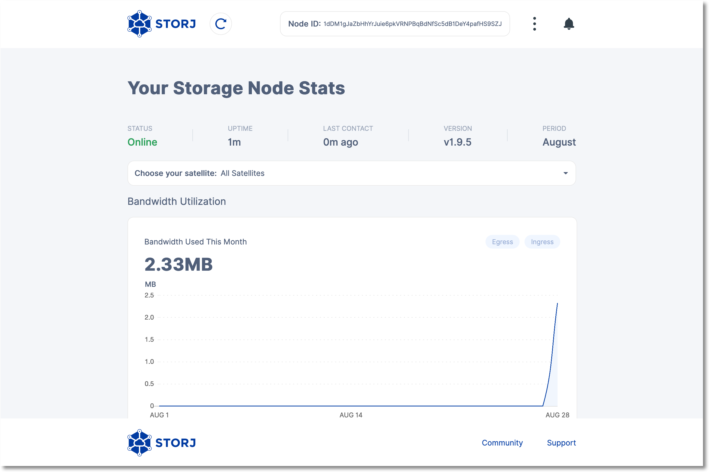
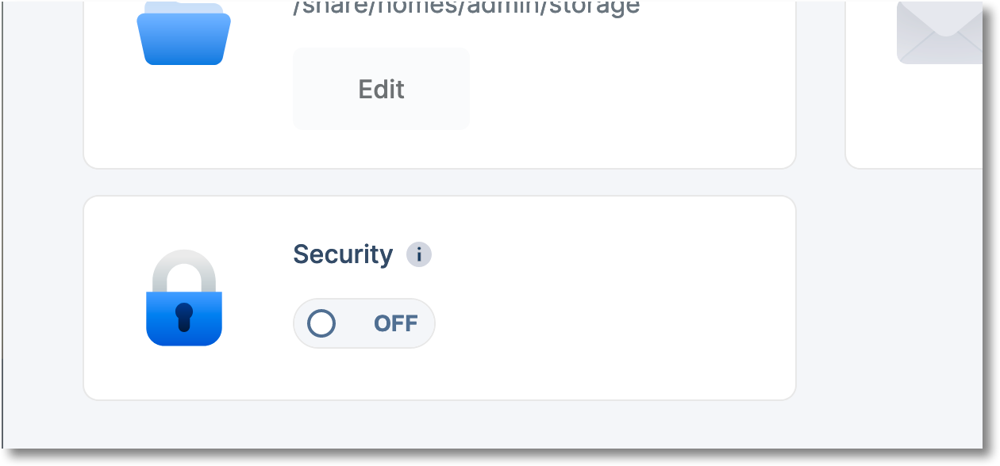

# QNAP Storagenode User Guide

## Install App

https://github.com/storj-thirdparty/qnap-storagenode-app/releases

## Pre-Requisites

Be sure you have your Identity token you received from signing-up at [storj.io](https://storj.io).

You need to create two directories on your QNAP (using FileStation):

1. storage - this is the folder where network space will be shared with the decentralized cloud.  Make sure it's on a volume that has pleanty of space.  You'll be able to specifiy how much of the volumes space is contributed to the Storj network later on.  Be sure to remember this directory. (*e.g /share/Public/storage*)
2. identity - create a folder that will store your identity (*e.g. /share/homes/<your_user_id>/identity*)

***

## Configure Storagenode

1. Enter your email address. (**Optional**)

   

2. Enter your Ethereum wallet address where STORJ ERC-20 tokens will be deposited 

   

3. Set the amount of disk space you want to share with the network. (At least 500 GB) 

   

4. Set the storage directory you created above.

   

5. Configure port forwarding.  Please note if you are on a NAT'd network or behind a firewall you'll need to make appropriate changes to your network gear to support **reaching the QNAP device from the public internet on 28967 tcp/udp port.**

   

6. Time to generate your identity and use the second path you created in the pre-requisites.   The identity keys you generate uniquely identify your node to the network.  You can either enter the abolute path to your identity directory or click the "Browse" button and enter it.

Once the path is selected, if you do not have an Identity, click the **"I don't have an identity"** button.  The next screen you get is where you will enter your node invite token:

After clicking **Generate** the identity creation process will begin.  Duration for genereation takes anywhere from minutes to hours depending on a number of factors.

Click **Finish** to allow the process to run in the background and return to the main configuration area.

## General Config

The main config screen allows you to modify any of the parameters you entered during the setup wizard.  Note that the Node must be in a **Stopped** status in order to edit any of the parameters.

Clicking the **Dashboard** link in the header will take you to your operatonal stats for your Storage Node.

## Additional Notes

1. Security - Activating the Security switch will cause the app to require authentication to the config area.  Please authenticate with your QNAP login credentials.
   

2. Storage Node container is updated nightly via crontab entries - configruation items are stored outside the container.

3. If you ever need to get more information(debugging, etc.) you can view the logs and other status items in Container Station:

   

   

